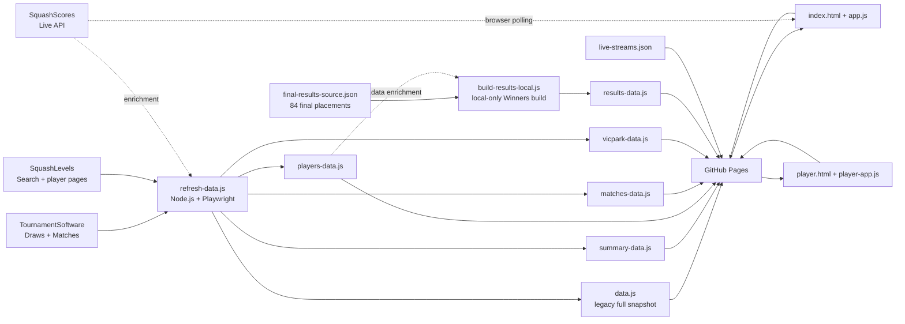
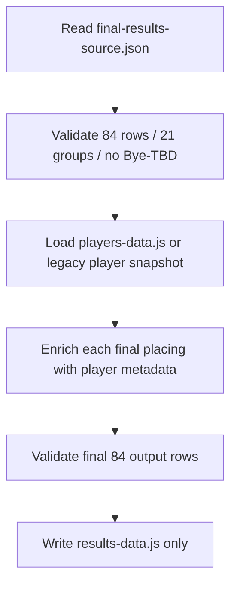

# World Squash Masters 2026 — Vic Park Edition

> An unofficial companion website for the **2026 WSF World Masters Championships in Perth**, tailored to make it easier for Vic Park Squash Club members and friends to follow players, schedules, live matches, courts, favourites and final winners.

The application is intentionally built as a **static website**: there is no application server and no database. Tournament data is written into JavaScript data files and served directly by GitHub Pages.

The tournament is now complete. The final top-four placings are therefore maintained separately from the schedule/history pipeline in a dedicated, validated final-results source.

---

## Contents

- [What the application does](#what-the-application-does)
- [Architecture at a glance](#architecture-at-a-glance)
- [Data-source authority](#data-source-authority)
- [Repository layout](#repository-layout)
- [Frontend architecture](#frontend-architecture)
- [Winners architecture](#winners-architecture)
- [Data files and data model](#data-files-and-data-model)
- [Refresh architecture](#refresh-architecture)
- [Refresh commands](#refresh-commands)
- [TournamentSoftware draw rules](#tournamentsoftware-draw-rules)
- [Live scores with SquashScores](#live-scores-with-squashscores)
- [Live-stream architecture](#live-stream-architecture)
- [SquashLevels integration](#squashlevels-integration)
- [Vic Park and favourites](#vic-park-and-favourites)
- [Local development](#local-development)
- [GitHub Actions and publishing](#github-actions-and-publishing)
- [Common maintenance tasks](#common-maintenance-tasks)
- [Validation and safety rules](#validation-and-safety-rules)
- [Debugging guide](#debugging-guide)
- [Security and secrets](#security-and-secrets)
- [Legacy and diagnostic files](#legacy-and-diagnostic-files)
- [External services](#external-services)
- [Time zone](#time-zone)
- [Developer checklist](#developer-checklist)
- [Project status](#project-status)

---

## What the application does

The main site is a single-page interface with hash-based navigation:

| Page | Purpose |
| --- | --- |
| **Home** | Tournament summary, participation information and country map. |
| **Live** | Matches currently in progress according to SquashScores, grouped by venue. |
| **Vic Park & Friends** | Matches involving the configured tracked-player list. |
| **Players** | Search, filter and sort the tournament player directory. |
| **Winners** | Final top-four placings for all 21 age/gender categories plus the medal matrix. |
| **Fav Players** | User-selected favourite players stored locally in the browser. |
| **Courts** | Tournament schedules grouped by the known Perth venues/courts. |

There is also a separate `player.html` page for a player's full tournament schedule and history.

The application combines five kinds of information:

1. **TournamentSoftware** — official tournament players, draws, schedule, venues, courts and match results.
2. **`final-results-source.json`** — authoritative finished-tournament 1st–4th placings.
3. **SquashScores** — current live-match state and live game scores.
4. **SquashLevels** — player profile links, World ranking and Level.
5. **`live-streams.json`** — manually maintained streaming URLs for selected venue/court streams.

---

## Architecture at a glance



### Design principle

The browser is **not** responsible for rebuilding tournament data.

Two independent durable data paths now exist:

- the TournamentSoftware schedule/history path;
- the finished-tournament Winners path.

The Winners path deliberately does **not** infer final placings from `matches-data.js` or legacy `data.js.results`.

---

## Data-source authority

This hierarchy is important. Most subtle bugs occurred when one source was allowed to overwrite information that it did not actually prove.

### 1. `final-results-source.json`: final placing authority

For the completed tournament, this is the authoritative source for:

- 1st place,
- 2nd place,
- 3rd place,
- 4th place,
- all 21 age/gender groups.

Hard invariants:

- exactly **84 rows**;
- exactly **21 groups**;
- exactly **4 places per group**;
- four distinct real players per group;
- **no `Bye`**;
- **no `TBD`**.

The final Winners table is never reconstructed from incomplete schedule rows.

### 2. TournamentSoftware draw: fixture identity authority

For tournament match schedule/history, the draw establishes things such as:

- which players belong to a fixture,
- draw progression,
- round/placement structure,
- date/time when explicitly tied to the match,
- deterministic Bye progression.

A draw Bye is useful for a player's progression history, but a Bye is **never a final Winners placing**.

### 3. TournamentSoftware Matches page: schedule/location/result evidence

The Matches views provide additional official evidence for:

- date/time,
- venue,
- court,
- score/result,
- status,
- partial `Player vs TBD` slots.

A Matches-page observation can be joined to a draw fixture only when the match identity is sufficiently unambiguous.

### 4. Existing published data: historical continuity

Normal tournament refresh logic is conservative.

Absence from one fresh scrape is **not** enough evidence to delete a previously published historical fixture.

### 5. SquashScores: live-state authority

SquashScores is authoritative for **what is live right now** and for current live game scores.

It can mark a match `IN PLAY` before the first point is entered and can remove completed matches from its live overview soon after completion.

### 6. SquashLevels: player enrichment only

SquashLevels enriches player identity with:

- profile URL / player ID,
- World ranking,
- Level,
- provisional status,
- club/location information.

SquashLevels must never change tournament fixture identity or final placing order.

---

## Repository layout

### Core website files

| File | Responsibility |
| --- | --- |
| `index.html` | Main SPA shell: Home, Live, Players, Winners, Fav Players, Courts, Vic Park & Friends. Also contains the cache-busted `app.js` revision. |
| `app.js` | Main frontend logic: lazy data loading, page rendering, Winners rendering, medal matrix, live polling, favourites, venue/court rendering and live streams. |
| `styles.css` | Shared site styling and responsive/mobile layout. |
| `player.html` | Standalone player-detail page. |
| `player-app.js` | Player-detail rendering, history/current grouping and live overlay behavior. |
| `vic-park-players.js` | Manually maintained tracked-player list for Vic Park & Friends. |

### Generated/published data files

| File | Browser global | Purpose |
| --- | --- | --- |
| `summary-data.js` | `window.TOURNAMENT_SUMMARY` | Small Home-page summary. |
| `players-data.js` | `window.TOURNAMENT_PLAYERS` | Player directory and SquashLevels metadata. |
| `matches-data.js` | `window.TOURNAMENT_MATCHES` | Full published match/Bye dataset. |
| `vicpark-data.js` | `window.VIC_PARK_DATA` | Compact tracked-player subset. |
| `results-data.js` | `window.TOURNAMENT_RESULTS` | Final 84 Winners placements enriched with player metadata. |
| `data.js` | `window.TOURNAMENT_DATA` | Legacy/compatibility snapshot containing players + matches and older result data. |

### Winners source/build files

| File | Responsibility |
| --- | --- |
| `final-results-source.json` | Authoritative finished-tournament top four for every category. |
| `build-results-local.js` | Validates the 84 placements, enriches them from local player data and writes only `results-data.js`. |
| `test-results-local.js` | Offline Winners validation/regression test. |

### Tournament refresh/integration files

| File | Responsibility |
| --- | --- |
| `refresh-data.js` | Full TournamentSoftware/SquashLevels/SquashScores refresh pipeline. |
| `validate-data.js` | Command-line validation/report of generated tournament data. |
| `split-data.js` | Rebuilds split data files from an existing `data.js`. |
| `player-links.json` | Cached TournamentSoftware player identities/URLs where present. |
| `squashlevels-overrides.json` | Hard mappings for known ambiguous SquashLevels identities. |
| `squashlevels-nicknames.json` | Explicit first-name equivalence groups used by SquashLevels matching. |
| `sync-live-streams.js` | Generates `live-streams.js` from `live-streams.json` for `file://` testing. |
| `live-streams.json` | Human-maintained live-stream configuration. |
| `live-streams.js` | JavaScript mirror for direct local-file browsing. |
| `live-stream.html` | Minimal stream redirect/player helper. |

### Diagnostics

Examples:

| File | Purpose |
| --- | --- |
| `refresh-audit.json` | Refresh counts and tracked-player diagnostics. |
| `refresh-matches.json` | Diagnostic JSON copy of generated matches. |
| `squashlevels-debug.json` | SquashLevels identity/parser diagnostics. |
| `squashlevels-profile-debug.json` | SquashLevels profile parser diagnostics. |
| `squashlevels-session-check.json` | Session/authentication diagnostics. |

---

## Frontend architecture

### Main SPA

`index.html` contains the page shells. `app.js` switches them with `#hash` navigation.

The application lazy-loads larger datasets:

```text
Home
  └─ summary-data.js

Players
  └─ players-data.js

Winners
  ├─ results-data.js
  └─ players-data.js when needed for related metadata/navigation

Courts / Favourites / Live
  ├─ players-data.js
  └─ matches-data.js

Vic Park & Friends
  ├─ vicpark-data.js
  ├─ players-data.js
  └─ matches-data.js
```

If a split tournament file cannot be loaded, older parts of the frontend can fall back to `data.js` where appropriate.

The Winners page does **not** fall back to legacy result inference. Its published source is `results-data.js`.

### Player detail page

`player.html` is a separate page rather than a SPA section.

`player-app.js`:

- resolves a player by official ID where possible;
- prevents same-name players in different categories from bleeding into one another;
- groups today/future matches under Current Matches;
- groups previous dates under History;
- overlays live SquashScores state where an exact fixture can be identified.

### Browser persistence

The frontend uses browser storage for:

- favourite players;
- today's completed SquashScores cache;
- automatic-refresh/session guards.

These are client-side conveniences. Tournament history and Winners data do not depend on browser storage.

---

## Winners architecture

### Tab name

The navigation tab is named:

```text
Winners
```

The internal page id remains `#results` for compatibility with existing frontend code.

### Final source

`final-results-source.json` contains only the placement essentials:

```json
{
  "gender": "Women",
  "ageGroup": 70,
  "place": 1,
  "playerName": "Pauline Douglas"
}
```

`build-results-local.js` enriches each placement from `players-data.js`/local player metadata with fields such as:

- official profile URL and player ID;
- country and flag;
- seed;
- SquashLevels World ranking;
- SquashLevels Level;
- club/location.

### Why Winners are separate from matches

The flattened match schedule does not retain every result-only bracket edge required to reconstruct every terminal placing reliably.

Therefore:

> **Final placings are never inferred from `matches-data.js`.**

The old `data.js.results` snapshot is also not considered authoritative because it contains incomplete groups from earlier tournament refresh states.

### Medal matrix

The medal matrix counts:

- Gold = place 1;
- Silver = place 2;
- Bronze = place 3.

Place 4 appears in the detailed Winners cards but is not counted as a medal.

The medal matrix has two independent checkboxes:

- **Male** — checked by default;
- **Female** — checked by default.

There is no separate Gender heading or “Most medals” frame/title above these controls.

The medal matrix checkboxes are independent of the detailed Winners filters.

### Detailed Winners filters

The age-group result cards retain the separate filters:

- Gender: All / Male / Female;
- Age: All / available age groups;
- Country: All / available countries.

### Winners validation

Before `results-data.js` is written, the builder verifies:

```text
21 groups
× 4 placements
= 84 real-player rows
```

It rejects:

- missing positions;
- duplicate position numbers;
- duplicate top-four players within a group;
- unexpected groups;
- `Bye`;
- `TBD`;
- any source row count other than 84.

If validation fails, `results-data.js` is left unchanged.

---

## Data files and data model

### Player shape

Representative fields:

```js
{
  name: "...",
  seed: "...",
  officialPlayerId: "q:player:123",
  officialProfileUrl: "https://wsf.tournamentsoftware.com/...",
  ageGroup: 60,
  gender: "Men",
  country: "Australia",
  iso3: "AUS",
  flagCode: "au",

  squashLevelsPlayerId: "...",
  squashLevelsUrl: "...",
  squashLevelsIdentityVerified: true,
  squashLevelsWorldRank: 123,
  squashLevelsLevel: 4567,
  squashLevelsLevelProvisional: false
}
```

### Match shape

Representative fields:

```js
{
  date: "2026-09-06",
  time: "11:30",
  event: "Men's 35+",
  round: "...",

  player1: "Player A",
  player1Id: "q:player:123",
  player2: "Player B",
  player2Id: "q:player:456",

  venue: "Belmont Saints Squash Centre",
  court: "SC2",

  result: "11-8, 9-11, 11-7, 11-6",
  winner: "Player A",
  winnerId: "q:player:123",
  status: "completed",

  source: "TournamentSoftware ...",
  resultSource: "TournamentSoftware"
}
```

### Winners row shape

Representative generated `results-data.js` row:

```js
{
  event: "Women's +70",
  gender: "Women",
  ageGroup: 70,
  place: "1",
  placeRank: 1,
  playerName: "Pauline Douglas",

  officialPlayerId: "...",
  officialProfileUrl: "...",
  country: "...",
  iso3: "...",
  flagCode: "...",
  seed: "...",

  squashLevelsWorldRank: 123,
  squashLevelsLevel: 4567,
  squashLevelsLevelProvisional: false,
  club: "...",

  source: "Final tournament results source",
  resultMethod: "final-results-source-v28"
}
```

### Deterministic Bye rows

A draw Bye is not a played match. It may exist in the schedule/player-history dataset only when useful for progression:

```js
{
  playerDetailOnly: true,
  deterministicBye: true,
  player1: "Player A",
  player2: "Bye",
  status: "bye",
  source: "TournamentSoftware Draw Tree"
}
```

A deterministic Bye must never be copied into `final-results-source.json` or `results-data.js`.

### Identity rule

Prefer `officialPlayerId` whenever available.

Name comparison is tolerant of accents, apostrophe variants, seeds and ordering, but normalized-name matching is only a fallback and must not merge distinct real players.

---

## Refresh architecture

There are now **two different refresh concepts**.

### A. Winners refresh — default `npm run refresh`

The current `package.json` maps:

```bash
npm run refresh
```

and:

```bash
npm run refresh:quick
```

to:

```text
node build-results-local.js
```

This is intentionally **local-only**.

Flow:



It does **not**:

- launch Playwright;
- open TournamentSoftware;
- parse `matches-data.js`;
- infer semifinal/final relationships;
- contact SquashScores;
- contact SquashLevels;
- make any network request.

### B. Full tournament refresh

The historical tournament scraper remains available as:

```bash
npm run refresh:full
```

This invokes:

```text
refresh-data.js :full
```

and is the separate path for TournamentSoftware/SquashLevels tournament-data maintenance.

Because the event is finished, use this path only when there is a specific reason to rebuild the tournament player/match dataset.

### Write boundary

The Winners builder writes only:

```text
results-data.js
```

and only after all final-placement validation passes.

If validation fails, it exits non-zero and leaves the existing published Winners file unchanged.

---

## Refresh commands

Install dependencies:

```bash
npm install
```

or:

```bash
npm ci
```

### Build Winners data

```bash
npm run refresh
```

Equivalent aliases:

```bash
npm run refresh:quick
npm run build:results
```

Expected ending:

```text
Final groups: 21
Final placement rows: 84
Bye/TBD placements: 0
```

### Test Winners source

```bash
npm run test:results
```

Expected result:

```text
RESULT SOURCE V28 TESTS PASSED
84 rows / 21 groups / 0 Bye-TBD placements
```

### Full TournamentSoftware rebuild

```bash
npm run refresh:full
```

### SquashLevels only

```bash
npm run refresh:squashlevels
```

Single-player diagnostic where supported:

```bash
npm run refresh:squashlevels -- "Susan Hillier"
```

### Interactive SquashLevels login setup

```bash
npm run refresh:squashlevels-login
```

### Validate tournament dataset

```bash
npm run check
```

### Rebuild split tournament data from `data.js`

```bash
npm run split-data
```

---

## TournamentSoftware draw rules

These rules apply to the schedule/history scraper, not to the final Winners source.

### Draw-list names vs linked-page headings

TournamentSoftware can expose misleading or context-dependent headings after opening a draw link.

When draw identity is required, prefer the name attached to the draw entry on the official **Draws index** rather than assuming the linked page heading is authoritative.

This was especially important for main vs placement/extra draw interpretation during the tournament.

### Do not infer venue from an `SC` court number

Hard invariant:

> **`SC1`, `SC2`, `SC3`, etc. are not globally unique venue identifiers.**

Both Belmont and Mirrabooka use `SC...` court labels.

Therefore this is invalid:

```text
SC2 -> Mirrabooka    ❌
SC2 -> Belmont       ❌
```

Venue and court must be tied to the same official match evidence.

`AGC` is special because it identifies the Karrinyup glass court for this event.

Known canonical venues:

- `Karrinyup Shopping Centre`
- `Belmont Saints Squash Centre`
- `Squashworld Mirrabooka`

### Partial official slot joining

Example of a safe join:

```text
Draw:          Jason Patmore vs Opponent X @ 11:30
Matches page:  Jason Patmore vs TBD        @ 11:30, Belmont SC3
```

The sources can be combined only when the player/date/time slot is unique and unambiguous.

### Placement draws

Small placement draws must not be validated against the full age-group entrant count. They are intentionally tiny terminal draws.

This rule remains relevant to historical scraper maintenance even though Winners are no longer derived from those rows.

---

## Live scores with SquashScores

### Browser polling

`app.js` polls the SquashScores public overview while relevant pages are active.

The polling loop self-schedules after the previous request completes to avoid overlapping requests.

### Live-page source of truth

The Live page uses the newest SquashScores feed directly.

TournamentSoftware is used only to enrich a live row when the fixture can be matched safely.

### `IN PLAY` at 0–0

SquashScores can explicitly mark a match `IN PLAY` before a score is entered.

An explicit live state therefore remains authoritative even when `result` is empty.

### Terminal states

Rows with terminal evidence must not remain Live, including:

- finished/completed;
- retired/retirement;
- withdrawn;
- walkover;
- defaulted;
- abandoned/cancelled.

### Today's completed-score cache

The browser temporarily retains today's explicitly completed SquashScores rows so a just-finished result does not disappear immediately when removed from the live overview.

This cache is today-only and is not a replacement for TournamentSoftware history.

### Venue grouping

The Live page uses the known venue groups:

1. Karrinyup Shopping Centre
2. Belmont Saints Squash Centre
3. Squashworld Mirrabooka

Do not silently create an `Other venue` group for unresolved rows.

---

## Live-stream architecture

Stream configuration is separate from tournament data.

### Configuration format

`live-streams.json`:

```json
{
  "streams": [
    {
      "venue": "Squashworld Mirrabooka",
      "court": "SC5",
      "url": "https://..."
    },
    {
      "venue": "Belmont Saints Squash Centre",
      "court": "SC2",
      "url": "https://..."
    },
    {
      "venue": "Karrinyup Shopping Centre",
      "court": "*",
      "url": "https://..."
    }
  ]
}
```

### Stream matching

- Karrinyup can use its configured venue stream regardless of displayed court token.
- Belmont and Mirrabooka require venue + configured court to match.
- Stream matching uses the same venue classification as the rest of the application.

### Published site loading

On HTTP/HTTPS the app prefers current JSON and uses cache-busting/no-store behavior where implemented.

### `file://` local testing

Direct local-file browser security can block sibling JSON fetches.

For direct `file://` testing, regenerate the JavaScript mirror after changing the JSON:

```bash
node sync-live-streams.js
```

A local HTTP server is preferred for realistic testing.

---

## SquashLevels integration

SquashLevels matching is intentionally conservative because duplicate/common names are frequent.

### Matching evidence

The pipeline can consider:

- exact/normalized player name;
- country;
- expected age group;
- candidate profile evidence;
- duplicate candidates;
- profile/last-match evidence where useful.

A name-only match should not be considered sufficient when ambiguity exists.

### Nickname fallback

`squashlevels-nicknames.json` contains explicit equivalence groups where present.

Nickname fallback must remain constrained by surname/country/age evidence.

### Hard overrides

Use `squashlevels-overrides.json` when the automatic resolver cannot safely choose the correct profile.

The override selects identity, not a frozen ranking or Level.

### Winners enrichment

The Winners build does **not** contact SquashLevels.

It uses the SquashLevels values already stored in the local player snapshot.

This is why rebuilding Winners is fast and deterministic.

---

## Vic Park and favourites

### Vic Park & Friends

The tracked list is defined in:

```text
vic-park-players.js
```

Change that file when the club watchlist changes.

The page should use the full match dataset whenever possible, with official player IDs preferred over name-only matching.

### Favourites

Fav Players are selected by each browser user and stored in `localStorage`.

They are not committed to the repository and do not modify the Vic Park tracked list.

---

## Local development

### Requirements

- Node.js 20+ recommended
- npm
- Playwright/Chromium only for full scraper work
- a modern browser

The currently used Node.js 24.x runtime is compatible with the local Winners builder.

### Install

```bash
npm ci
```

If full scraper work requires a browser:

```bash
npx playwright install chromium
```

### Run the static site

Directly opening `index.html` can work, but `file://` behavior is not identical to production.

Preferred:

```bash
python -m http.server 8000
```

then open:

```text
http://localhost:8000/
```

### Browser cache while developing

`index.html` carries an `app.js?rev=...` query string.

Bump that revision when deploying significant `app.js` behavior changes so previously open browsers do not keep stale code.

The current Winners UI revision uses the V31 cache-busting revision.

---

## GitHub Actions and publishing

The project can be published as a static GitHub Pages site.

### Important current-state note

`npm run refresh` now means **Winners-only local build**, not the old full TournamentSoftware refresh.

Any GitHub workflow that still assumes `npm run refresh` rebuilds all tournament data should be reviewed before re-enabling automated runs.

For the current Winners path, the generated file that changes is:

```text
results-data.js
```

If CI is used to rebuild Winners, make sure `results-data.js` is included in the files staged/committed by the workflow.

### Frontend/source changes

Files such as these are normal developer commits rather than generated Winners output:

```text
index.html
app.js
styles.css
final-results-source.json
vic-park-players.js
live-streams.json
```

`final-results-source.json` is authoritative source data and should be reviewed like source code, not silently regenerated by CI.

---

## Common maintenance tasks

### Correct a final placing

1. Edit only the relevant rows in:

   ```text
   final-results-source.json
   ```

2. Run:

   ```bash
   npm run test:results
   ```

3. Rebuild:

   ```bash
   npm run refresh
   ```

4. Confirm:

   ```text
   84 rows
   21 groups
   0 Bye/TBD
   ```

5. Review the changed `results-data.js` before publishing.

Do **not** patch a placing directly into `app.js`.

### Change Winners UI

For navigation, medal matrix or Winners filter changes:

- edit `index.html` and/or `app.js`;
- do not alter `final-results-source.json` unless the actual placings change;
- bump the `app.js?rev=...` value in `index.html` when needed.

Current Winners UI:

- tab label = **Winners**;
- Male checkbox = checked by default;
- Female checkbox = checked by default;
- no Gender title above those checkboxes;
- no “Most medals” summary frame/title;
- detailed Gender/Age/Country filters remain below the medal table.

### Change Vic Park watchlist

Edit:

```text
vic-park-players.js
```

### Change live streams

1. Edit `live-streams.json`.
2. If direct `file://` testing matters, run:

   ```bash
   node sync-live-streams.js
   ```

3. Commit the updated stream configuration/mirror as appropriate.

### Fix a SquashLevels identity

1. Confirm the exact TournamentSoftware player name.
2. Add the correct mapping to `squashlevels-overrides.json`.
3. Run:

   ```bash
   npm run refresh:squashlevels
   ```

4. Verify the intended player only.

---

## Validation and safety rules

### Winners safeguards

The finished-tournament Winners build must fail rather than publish suspicious output.

Required:

- 21 known groups;
- four places per group;
- exactly 84 source rows;
- four distinct players per group;
- no `Bye`;
- no `TBD`;
- no missing place;
- no duplicate place.

If any check fails:

> **`results-data.js` must remain unchanged.**

### Match/schedule safeguards

Historical tournament refresh safeguards include:

- player-directory coverage checks;
- plausible country/age/gender coverage;
- draw-tree completeness checks;
- special handling for small placement draws;
- tournament-date range validation;
- deterministic Bye shape validation;
- location proof rather than court-number guessing;
- historical fixture collapse guards;
- future result/winner sanitization;
- conservative duplicate cleanup;
- SquashScores cannot delete static TournamentSoftware fixtures.

### Key philosophy

For schedules:

> **A partial fresh scrape is evidence for additions/updates, not automatically evidence for deletions.**

For Winners:

> **A missing bracket edge is not permission to invent a placing.**

---

## Debugging guide

### Winners contains a Bye or TBD

This should now be impossible.

Run:

```bash
npm run test:results
```

If the test passes but the browser still shows a Bye/TBD:

1. inspect the deployed `results-data.js`;
2. verify the browser loaded the current `app.js` revision;
3. hard-refresh/cache-clear;
4. confirm GitHub Pages deployed the expected branch/folder.

Do not add a Bye fallback to the Winners builder.

### Winners build says a place is missing

Inspect:

```text
final-results-source.json
```

The source must have places 1, 2, 3 and 4 for that exact gender/age group.

### Correct Winners source but wrong player metadata

The placement order comes from `final-results-source.json`, while country/ranking/club data is enriched from the player snapshot.

Check the corresponding player in:

```text
players-data.js
```

and verify same-name player disambiguation by gender/age.

### Winners page is stale after UI change

Check the cache revision in `index.html`:

```text
app.js?rev=...
```

Then verify the deployed HTML actually contains the new revision.

### A Vic Park player has a match on TournamentSoftware but it is missing

Check in this order:

1. player is present in `vic-park-players.js`;
2. fixture exists in `matches-data.js`;
3. if yes, inspect Vic Park filtering/rendering;
4. if no, inspect the TournamentSoftware refresh/merge diagnostics.

Do not patch the UI to fabricate a missing schedule row.

### Correct court, wrong venue

Do **not** map `SC2`, `SC3`, etc. to a venue.

Inspect the venue evidence attached to that exact fixture.

### Live page missing a 0–0 match

Check SquashScores explicit state. `IN PLAY` remains live even before score entry.

### Retired/finished match remains Live

Inspect terminal state parsing. Explicit finished/retired/withdrawn evidence must win over partial scores.

### SquashLevels says login failed but session is valid

Do not assume a missing Level/ranking is an authentication issue.

First check:

- selected player identity;
- profile parser result;
- duplicate/profile verification;
- stored-session diagnostics.

---

## Security and secrets

Do not commit real SquashLevels credentials or browser session state.

Typical ignored secret/diagnostic files include:

```text
config.json
squashlevels-profile-debug.json
squashlevels-debug.json
squashlevels-session-check.json
squashlevels-storage-state.json
squashlevels-session-storage.json
squashlevels-session-storage.b64.txt
squashlevels-storage-state.b64.txt
```

Local `config.json` logical shape:

```json
{
  "squashLevels": {
    "email": "...",
    "password": "...",
    "loginUrl": "https://app.squashlevels.com/login"
  }
}
```

Treat saved Playwright browser state as credentials.

`final-results-source.json` contains public tournament placement data and is safe to commit.

---

## Legacy and diagnostic files

This project evolved rapidly during the live tournament and contains old repair/version notes such as:

```text
README-RESULTS-V10-FIX.txt
README-RESULTS-V11-FIX.txt
...
README-RESULTS-V28.txt
```

These files are historical context only.

They describe intermediate algorithms that attempted to infer final placings from incomplete TournamentSoftware bracket/schedule representations.

They are **not the current Winners architecture**.

For current behavior, start with:

```text
final-results-source.json
build-results-local.js
test-results-local.js
results-data.js
app.js
index.html
players-data.js
matches-data.js
refresh-data.js
```

Avoid reintroducing old V18–V27 semifinal/extra-stage inference logic into the finished Winners path.

---

## External services

### World Squash Masters / TournamentSoftware

Tournament ID:

```text
1d88743a-54e2-4073-bd30-a4f443a442f0
```

Official draws:

```text
https://wsf.tournamentsoftware.com/sport/draws.aspx?id=1d88743a-54e2-4073-bd30-a4f443a442f0
```

Official matches:

```text
https://wsf.tournamentsoftware.com/tournament/1d88743a-54e2-4073-bd30-a4f443a442f0/Matches
```

### SquashScores

Live overview used during the tournament:

```text
https://www.squashscores.com/inprogress.php?categoryId=19&hideControls=1&tourname=World+Squash+Masters+2026&tz=Australia%2FPerth
```

Public overview API:

```text
https://squashscores.com/api/overview/public/?categoryId=19
```

### SquashLevels

```text
https://www.squashlevels.com/
```

---

## Time zone

All tournament “today”, live-window and day-rollover decisions should use:

```text
Australia/Perth
```

Do not rely on the user's device time zone for tournament-day classification.

The final Winners data itself is timeless once published and does not depend on the current date.

---

## Developer checklist

### Before changing Winners logic

- [ ] Am I changing an actual placing, or only display/metadata?
- [ ] If a placing changed, did I edit `final-results-source.json` rather than infer from matches?
- [ ] Does the source still contain exactly 84 rows?
- [ ] Are there exactly 21 groups and four places per group?
- [ ] Are all 84 placements real players?
- [ ] Are there zero `Bye` and zero `TBD` values?
- [ ] Are all four players in each group distinct?
- [ ] Did I run `npm run test:results`?
- [ ] Did I run `npm run refresh`?
- [ ] Did I review the generated `results-data.js`?
- [ ] If `app.js` changed, did I bump its revision in `index.html`?

### Before changing match/history logic

- [ ] Am I using official player IDs where available?
- [ ] Am I using the draw as fixture identity authority rather than arbitrary nearby text?
- [ ] Is venue evidence tied to the same match?
- [ ] Have I avoided inferring venue from an `SC` court number?
- [ ] Can a partial scrape accidentally delete published history?
- [ ] Will a played-today match remain visible after the bracket progresses?
- [ ] Does explicit SquashScores `IN PLAY` still work at 0–0?
- [ ] Do retirement/finished states still remove matches from Live?
- [ ] Does the change affect Vic Park, Favourites, Courts and player profiles consistently?

---

## Project status

The tournament is complete.

The codebase still retains the live-tournament schedule/history and integration tooling, but final Winners are now treated as a **finished, validated dataset** rather than a continually inferred bracket state.

Current Winners design:

```text
final-results-source.json
        ↓
build-results-local.js
        ↓
results-data.js
        ↓
Winners tab in app.js
```

This separation is intentional. It prevents schedule-history cleanup, TournamentSoftware page-title quirks, missing bracket edges, Bye progression rows or live-data changes from changing the published final placings.

For maintenance, prefer **small, evidence-based changes** and preserve the validation barriers around both the schedule pipeline and the Winners pipeline.
