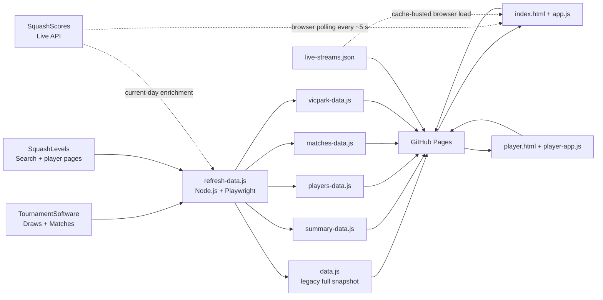
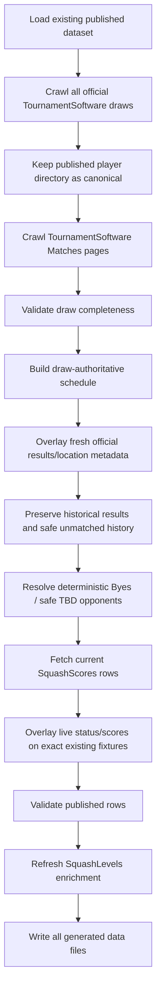

# World Squash Masters 2026 — Vic Park Edition

> An unofficial companion website for the **2026 World Squash Masters Championships in Perth**, tailored to make it easier for Vic Park Squash Club members and friends to follow players, schedules, results, live matches and available live streams.

The application is intentionally built as a **static website**: there is no application server and no database. Tournament data is collected ahead of time by a Node.js/Playwright refresh process, written into JavaScript data files, committed to the repository, and then served directly by GitHub Pages.

---

## Contents

- [What the application does](#what-the-application-does)
- [Architecture at a glance](#architecture-at-a-glance)
- [Data-source authority](#data-source-authority)
- [Repository layout](#repository-layout)
- [Frontend architecture](#frontend-architecture)
- [Data files and data model](#data-files-and-data-model)
- [Refresh architecture](#refresh-architecture)
- [Refresh commands](#refresh-commands)
- [TournamentSoftware draw rules](#tournamentsoftware-draw-rules)
- [Live scores with SquashScores](#live-scores-with-squashscores)
- [Live-stream architecture](#live-stream-architecture)
- [SquashLevels integration](#squashlevels-integration)
- [Vic Park and favourites](#vic-park-and-favourites)
- [Local development](#local-development)
- [GitHub Actions and publishing](#github-actions-and-publishing)
- [Common maintenance tasks](#common-maintenance-tasks)
- [Validation and safety rules](#validation-and-safety-rules)
- [Debugging guide](#debugging-guide)
- [Security and secrets](#security-and-secrets)
- [Legacy and diagnostic files](#legacy-and-diagnostic-files)
- [External services](#external-services)

---

## What the application does

The main site is a single-page interface with hash-based navigation:

| Page | Purpose |
| --- | --- |
| **Home** | Tournament summary, participation information and country map. |
| **Live** | Matches currently in progress according to SquashScores, grouped by venue. |
| **Vic Park & Friends** | Matches involving the configured tracked-player list. |
| **Players** | Search/filter/sort the tournament player directory. |
| **Fav Players** | User-selected favourite players stored locally in the browser. |
| **Courts** | Tournament schedules grouped around the known Perth venues/courts. |

There is also a separate `player.html` page for a player's full tournament schedule and history.

The application combines four kinds of information:

1. **TournamentSoftware** — official tournament players, draws, schedule, venues, courts and results.
2. **SquashScores** — current live-match state and live game scores.
3. **SquashLevels** — player profile links, World ranking and Level.
4. **`live-streams.json`** — manually maintained streaming URLs for selected venue/court streams.

---

## Architecture at a glance



### Design principle

The browser is **not** responsible for rebuilding the tournament schedule. The static generated TournamentSoftware dataset remains the durable schedule/history source. SquashScores is an in-browser **live overlay**, not a replacement database.

---

## Data-source authority

This hierarchy is important. Most subtle bugs occur when one source is allowed to overwrite information that it does not actually prove.

### 1. TournamentSoftware draw: fixture identity authority

For current and future tournament matches, the draw is used to establish things such as:

- which two players belong to a match,
- draw progression,
- round/placement structure,
- date/time when explicitly tied to the match,
- deterministic Bye progression.

The draw can still contain complete match information after a match has been played and the bracket has progressed.

### 2. TournamentSoftware Matches page: schedule/location/result evidence

The Matches views are used as another official source for:

- date/time,
- venue,
- court,
- result/status,
- partial `Player vs TBD` slot observations.

A Matches-page row may know the venue/court before it knows both opponents. The refresh code can combine that information with a draw fixture **only when the player/date/time slot is unique and unambiguous**.

### 3. Existing published data: historical continuity

Normal refreshes intentionally preserve already-published history. TournamentSoftware can render an incomplete subset from one request to the next, especially after a draw advances.

Therefore:

- absence from one fresh scrape is **not** sufficient evidence to delete a previously published match;
- past results are preserved and can be backfilled when fresh authoritative evidence becomes available;
- future fixtures are removed/replaced only when there is positive official conflict/replacement evidence.

### 4. SquashScores: live-state authority

SquashScores is authoritative for **what is live right now** and for current game scores.

It may:

- mark a match `IN PLAY` before the first point has been entered,
- contain a live match whose corresponding TournamentSoftware row is stale/moved/missing,
- remove a finished match from its live overview soon after completion.

The Live page therefore renders from the latest SquashScores feed and uses TournamentSoftware only for enrichment when a matching fixture exists.

### 5. SquashLevels: player enrichment only

SquashLevels must never change tournament fixture identity, schedule or results. It enriches players with:

- SquashLevels profile URL / player ID,
- World ranking,
- Level,
- provisional state,
- club/location evidence used for identity verification.

---

## Repository layout

### Core website files

| File | Responsibility |
| --- | --- |
| `index.html` | Main SPA shell: Home, Live, Players, Fav Players, Courts, Vic Park & Friends. Also contains cache-busted `app.js` revision. |
| `app.js` | Main frontend logic: lazy data loading, page rendering, live polling, favourites, venue/court rendering, live-stream buttons and mobile cache recovery. |
| `styles.css` | Shared site styling and responsive/mobile layout. |
| `player.html` | Standalone player-detail page. |
| `player-app.js` | Player-detail rendering, history/current grouping, SquashScores overlay and auto-refresh behavior. |
| `vic-park-players.js` | Manually maintained tracked-player list for Vic Park & Friends. |

### Generated data files

| File | Browser global | Purpose |
| --- | --- | --- |
| `summary-data.js` | `window.TOURNAMENT_SUMMARY` | Small Home-page summary. Loaded first for fast startup. |
| `players-data.js` | `window.TOURNAMENT_PLAYERS` | Player directory and SquashLevels metadata. |
| `matches-data.js` | `window.TOURNAMENT_MATCHES` | Full published match/Bye dataset. |
| `vicpark-data.js` | `window.VIC_PARK_DATA` | Compact tracked-player subset. Primarily an optimisation/fallback. |
| `data.js` | `window.TOURNAMENT_DATA` | Complete legacy/compatibility snapshot containing players + matches. |

`refresh-data.js` writes all five files together via `writeDataFiles()`.

### Refresh/integration files

| File | Responsibility |
| --- | --- |
| `refresh-data.js` | Main TournamentSoftware/SquashLevels/SquashScores refresh pipeline. |
| `validate-data.js` | Small command-line validation/report of the generated `data.js`. |
| `split-data.js` | Rebuilds the split data files from an existing `data.js`. Useful after migration/manual recovery. |
| `player-links.json` | Cached TournamentSoftware player-profile identities/URLs. Not required for the current draw-based schedule crawl, but retained for identity-related tooling. |
| `squashlevels-overrides.json` | Hard mappings for known ambiguous SquashLevels identities. |
| `squashlevels-nicknames.json` | Explicit first-name equivalence groups used by the SquashLevels fallback matcher. |
| `sync-live-streams.js` | Generates `live-streams.js` from `live-streams.json` for `file://` local-browser testing. |
| `live-streams.json` | Human-maintained live-stream configuration. |
| `live-streams.js` | Generated JavaScript mirror used when a browser opens the site directly from disk. |
| `live-stream.html` | Minimal redirect helper for a venue stream. |

### Diagnostics

| File | Purpose |
| --- | --- |
| `refresh-audit.json` | Refresh counts and tracked-player diagnostics. |
| `refresh-matches.json` | Diagnostic JSON copy of the latest generated matches. It is **not** the current browser runtime source. |
| `squashlevels-debug.json` | Diagnostic output when SquashLevels matching cannot be resolved. |
| `squashlevels-profile-debug.json` | SquashLevels profile parser diagnostics. |
| `squashlevels-session-check.json` | Session/authentication diagnostics. |

---

## Frontend architecture

### Main SPA

`index.html` contains the page shells. `app.js` switches them with `#hash` navigation via `setPage()`.

The application deliberately lazy-loads larger datasets:

```text
Home
  └─ summary-data.js only

Players
  └─ players-data.js

Courts / Favourites / Live
  ├─ players-data.js
  └─ matches-data.js

Vic Park & Friends
  ├─ vicpark-data.js        (small optimisation/fallback)
  ├─ players-data.js
  └─ matches-data.js        (preferred for correctness/history)
```

If a split file cannot be loaded, the frontend falls back to `data.js`.

### Why `vicpark-data.js` is not the source of truth

The compact Vic Park file was introduced for performance, but it must never hide history because a compact generation step missed a fixture.

`ensureVicParkData()` therefore prefers to derive tracked matches from the same **full `matches-data.js` dataset** used by the rest of the application. The compact file remains an optimisation/fallback.

### Player detail page

`player.html` is a separate page rather than a SPA section. `player-app.js`:

- resolves a player by official player ID where possible,
- prevents same-name players in different age groups from bleeding into one another,
- groups **today + future** under Current Matches,
- groups **dates before today** under History,
- overlays live SquashScores state where an exact fixture can be identified.

### Browser persistence

The frontend uses browser storage for a few user/runtime features:

- favourite player names,
- today's completed SquashScores result cache,
- automatic-refresh session guards.

These are client-side conveniences. Tournament history must not depend solely on local storage.

---

## Data files and data model

### Player shape

Representative fields:

```js
{
  name: "...",
  seed: "...",
  officialPlayerId: "q:player:123",
  officialProfileUrl: "https://wsf.tournamentsoftware.com/...",
  ageGroup: 60,
  gender: "Men",
  country: "Australia",
  iso3: "AUS",
  flagCode: "au",

  squashLevelsPlayerId: "...",
  squashLevelsUrl: "...",
  squashLevelsIdentityVerified: true,
  squashLevelsWorldRank: 123,
  squashLevelsLevel: 4567,
  squashLevelsLevelProvisional: false
}
```

### Match shape

Representative fields:

```js
{
  date: "2026-09-06",
  time: "11:30",
  event: "Men's 35+",
  round: "...",

  player1: "Player A",
  player1Id: "q:player:123",
  player2: "Player B",
  player2Id: "q:player:456",

  venue: "Belmont Saints Squash Centre",
  court: "SC2",

  result: "11-8, 9-11, 11-7, 11-6",
  winner: "Player A",
  winnerId: "q:player:123",
  status: "completed",

  source: "TournamentSoftware ...",
  resultSource: "TournamentSoftware"
}
```

### Deterministic Bye rows

A draw Bye is not a played match. It is stored only when useful for a player's progression view, with a strict special shape:

```js
{
  playerDetailOnly: true,
  deterministicBye: true,
  player1: "Player A",
  player2: "Bye",
  status: "bye",
  source: "TournamentSoftware Draw Tree"
}
```

A valid Bye row must not have date, time, venue, court, result or winner fields.

The summary count excludes these rows from the real match count.

### Identity rule

Prefer `officialPlayerId` whenever it exists.

Name comparison is deliberately tolerant of:

- accents,
- apostrophe variants,
- `Surname, Firstname` ordering,
- country suffixes,
- TournamentSoftware seeds such as `[1]` or `[17/32]`.

However, normalized-name matching is a fallback. It must not merge two real players who share the same displayed name.

---

## Refresh architecture

The current normal refresh is **draw based**. It does not need to crawl every player's TournamentSoftware profile for the schedule.

> [!NOTE]
> The introductory comment at the very top of `refresh-data.js` refers to an older player-profile strategy. The active normal flow near the bottom of the file is the authoritative description of the current architecture.

### Normal refresh flow



### Important normal-refresh behavior

A normal refresh deliberately keeps the existing published player directory as the canonical directory because players can disappear from currently rendered draw branches as the event progresses.

Fresh draw metadata is merged back by official identity.

For history, the normal refresh is conservative: it prefers preserving known-good published rows over deleting them because one scrape was incomplete.

### Write boundary

The generated website data is written only after the major structural checks pass. If the refresh throws an error, the command exits non-zero so the GitHub workflow does not publish the failed dataset.

---

## Refresh commands

Install dependencies first:

```bash
npm install
```

or, in CI/reproducible environments:

```bash
npm ci
```

Playwright also needs a Chromium-compatible browser. GitHub Actions installs it automatically.

### Normal refresh

```bash
npm run refresh
```

Use this for the complete normal pipeline:

- TournamentSoftware draws,
- TournamentSoftware Matches pages,
- player metadata,
- SquashScores current-day enrichment,
- SquashLevels enrichment,
- generated data files.

### Matches-only refresh

```bash
npm run refresh -- :matches
```

Use when you want to update tournament fixtures/results without spending time refreshing SquashLevels.

This mode:

- keeps the published player directory,
- requires a sufficiently complete existing match base,
- crawls both Matches pages **and authoritative draw trees**,
- preserves historical data conservatively,
- leaves SquashLevels values unchanged.

### Full rebuild

```bash
npm run refresh:full
```

`:`full` rebuilds the player directory from the currently exposed draw hierarchy.

> [!CAUTION]
> During a progressing tournament this is more risky than a normal refresh because eliminated/advanced players may no longer appear in every current draw representation. Use a full rebuild only when the current official draws themselves still provide complete enough coverage.

### SquashLevels only

```bash
npm run refresh:squashlevels
```

This leaves TournamentSoftware matches and the main tournament refresh timestamp unchanged.

Single-player diagnostic/test:

```bash
npm run refresh:squashlevels -- "Susan Hillier"
```

### Interactive SquashLevels login setup

```bash
npm run refresh:squashlevels-login
```

This is used to create/update local saved SquashLevels browser session state.

### Draw structure debug

```bash
node refresh-data.js :drawdebug
```

This scans official draw pages and produces structure diagnostics without publishing data.

### Validate the generated dataset

```bash
npm run check
```

### Rebuild split data from `data.js`

```bash
npm run split-data
```

---

## TournamentSoftware draw rules

This area deserves special attention because TournamentSoftware's bracket DOM changes as the draw progresses.

### Do not infer venue from an `SC` court number

This is a hard invariant:

> **`SC1`, `SC2`, `SC3`, etc. are not globally unique venue identifiers.**

Both Belmont and Mirrabooka use `SC...` court labels. Therefore this is invalid:

```text
SC2 -> Mirrabooka     ❌
SC2 -> Belmont        ❌
```

Venue and court must be treated as separate fields and tied to the same official match evidence.

`AGC` is special because it identifies the Karrinyup glass court in this tournament.

Known canonical venue names are:

- `Karrinyup Shopping Centre`
- `Belmont Saints Squash Centre`
- `Squashworld Mirrabooka`

### Bracket sibling fallback

A progressed draw can retain two numbered sibling player slots and an explicit match date/time while no longer rendering the connector span in the same place.

The fallback may use the sibling relationship to recover:

- player 1,
- player 2,
- date/time.

It must **not** take venue/court/result text from a nearby bracket row unless that location is proven to belong to the same match. Nearby bracket cells frequently belong to a different round/match.

### Partial official slot joining

A safe case looks like this:

```text
Draw:          Jason Patmore vs Opponent X @ 11:30
Matches page:  Jason Patmore vs TBD        @ 11:30, Belmont SC3
```

The two sources may be joined when Jason has exactly one official date/time slot that matches. The draw supplies the opponent; the Matches-page observation supplies the proven location.

If multiple possible locations or fixtures exist for that player/date/time, do not guess.

### Placement draws

Small placement draws such as:

- `3rd/4th`,
- `3/4`,
- `3rd-4th`,
- placement/playoff variants

must not be validated against the full age-group player count. They are intentionally tiny terminal draws.

---

## Live scores with SquashScores

### Browser polling

`app.js` polls the SquashScores public overview roughly every **5 seconds** while relevant pages are active.

The polling loop is self-scheduled after the previous request completes rather than using overlapping intervals. This prevents slow requests from stacking up.

### Live-page source of truth

The Live page uses the newest SquashScores feed directly.

TournamentSoftware is used only to enrich a live row with:

- official event/round,
- player IDs,
- official venue/court when the fixture can be matched safely.

A valid SquashScores live row is **not hidden just because TournamentSoftware has a stale or missing copy**.

### `IN PLAY` at 0–0

SquashScores can explicitly mark a match `IN PLAY` before any score has been entered.

An explicit live/`IN PLAY` state is therefore authoritative even when `result` is empty.

Do not reintroduce logic that requires a non-empty score before a row can be live.

### Terminal states

Rows indicating terminal states such as these must not remain live:

- finished/completed,
- retired/retirement,
- withdrawn,
- walkover,
- defaulted,
- abandoned/cancelled.

### Today's completed-score cache

The browser temporarily retains today's explicitly completed scored SquashScores rows so a just-finished result does not vanish when SquashScores removes it from the live overview.

This cache is **today-only** and is not a substitute for published TournamentSoftware history.

### Venue grouping

The Live page has exactly three venue groups:

1. Karrinyup Shopping Centre
2. Belmont Saints Squash Centre
3. Squashworld Mirrabooka

Do not create an `Other venue` bucket for unresolved rows. An unresolved row should generate a diagnostic warning so the location parsing can be fixed properly.

---

## Live-stream architecture

Stream configuration is deliberately separate from tournament data.

### Configuration format

`live-streams.json`:

```json
{
  "streams": [
    {
      "venue": "Squashworld Mirrabooka",
      "court": "SC5",
      "url": "https://..."
    },
    {
      "venue": "Belmont Saints Squash Centre",
      "court": "SC2",
      "url": "https://..."
    },
    {
      "venue": "Karrinyup Shopping Centre",
      "court": "*",
      "url": "https://..."
    }
  ]
}
```

### Stream matching

- Karrinyup has one configured stream; a current Karrinyup match can use it regardless of its displayed court token.
- Belmont and Mirrabooka require **both venue and configured court** to match.
- Stream matching uses the same venue classification as the rest of the application.

### Published site loading

On HTTP/HTTPS the current `app.js` tries:

1. raw GitHub `main/live-streams.json`,
2. same-origin `live-streams.json`,
3. JavaScript fallback if available.

Requests contain a timestamp and `cache: 'no-store'` to avoid stale CDN/browser copies.

### Mobile browser cache recovery

Some mobile browsers, particularly Samsung Internet/Safari-style tab restoration behavior, can restore a page from memory without rerunning page startup.

The app therefore re-reads stream configuration when:

- `pageshow` fires,
- the window regains focus,
- the document becomes visible again.

When changing the stream loader, preserve this behavior.

### `file://` local testing

A page opened by double-clicking `index.html` cannot reliably `fetch()` a sibling JSON file because of local-file browser security rules.

For `file://`, the site uses `live-streams.js` instead.

After editing the JSON run:

```bash
node sync-live-streams.js
```

Then reload the local page.

A better development setup is to serve the directory over a small local HTTP server. In that case the browser behaves much more like GitHub Pages and reads the JSON directly.

### Playback

Current `app.js` behavior:

- YouTube links open as normal YouTube pages.
- HLS/non-YouTube stream URLs open in the popup player using native HLS where supported or `hls.js` otherwise.

---

## SquashLevels integration

SquashLevels matching is intentionally conservative because common names and duplicate profiles are frequent.

### Normal matching approach

The pipeline considers:

- exact/normalized player name,
- country,
- expected age group,
- candidate profile evidence,
- duplicate candidates,
- last-match/profile evidence where useful.

A name-only match should not be treated as sufficient identity evidence when ambiguity exists.

### Nickname fallback

`squashlevels-nicknames.json` contains explicit equivalence groups, for example:

```json
{
  "groups": [
    ["Susan", "Sue"],
    ["Steven", "Stephen", "Steve"]
  ]
}
```

Nickname fallback remains constrained by surname/country/age evidence. It is not a fuzzy-name free-for-all.

### Hard overrides

Use `squashlevels-overrides.json` when the automatic identity resolver cannot safely choose the correct profile.

Example:

```json
{
  "Philip Taylor": "https://web.squashlevels.com/player_detail?player=462936"
}
```

Important rules:

- the key must match the **TournamentSoftware player name used in the dataset**;
- the override selects identity, not a frozen Level/ranking;
- the selected profile's current metrics are still refreshed normally;
- do not add an override for a player whose existing mapping is already correct.

### Authentication

The scraper can use:

- local `config.json` credentials,
- saved Playwright storage/session state,
- GitHub Actions environment secrets/base64 session state.

A normal tournament refresh treats SquashLevels as enrichment. If SquashLevels fails while TournamentSoftware data is valid, the refresh can preserve the previously stored SquashLevels values and continue publishing the tournament update.

---

## Vic Park and favourites

### Vic Park & Friends

The tracked list is defined in one file:

```js
// vic-park-players.js
window.VIC_PARK_PLAYERS = [
  "Roger Schmidlin",
  "..."
];
```

Change this file when the club watchlist changes.

The page should derive matches from the full dataset whenever possible, using both name and official-player-ID matching.

### Favourites

Fav Players are chosen by each browser user and stored in `localStorage`.

They are not committed to the repository and do not alter `vic-park-players.js`.

The Favourites page uses the same full match dataset and date/history rules as the rest of the website.

---

## Local development

### Requirements

- Node.js 20+ recommended
- npm
- Playwright/Chromium for refresh work
- a modern browser

### Install

```bash
npm ci
```

If Playwright has no browser installed:

```bash
npx playwright install chromium
```

### Run the static site

Simplest option: open `index.html` directly.

This works, but `file://` has special handling for data/stream files and is **not identical to production**.

Preferred option: serve the repository root over HTTP, for example with any local static-server tool or IDE extension.

If Python is available:

```bash
python -m http.server 8000
```

Then open:

```text
http://localhost:8000/
```

### Browser cache while developing

`index.html` carries an `app.js?rev=...` query string. Bump this revision when deploying significant frontend changes so clients do not keep an old JavaScript bundle.

For normal local development, hard reload with the browser developer tools if behavior appears inconsistent with the code on disk.

---

## GitHub Actions and publishing

Workflow:

```text
.github/workflows/pages.yml
```

The current workflow supports `workflow_dispatch` for manual runs. The cron block is presently commented out.

### Safe publish sequence

The workflow:

1. checks out `main`,
2. installs Node dependencies and Playwright Chromium,
3. resets to the latest remote `main`,
4. runs the refresh,
5. verifies generated data files are present/non-empty,
6. runs `node --check` on generated JavaScript data files,
7. checks whether `main` changed while the refresh was running,
8. retries from the newest `main` if necessary,
9. commits only the generated data files,
10. pushes the refresh commit.

This protects a long-running refresh from overwriting a newer human commit.

### Generated files committed by CI

The workflow currently commits:

```text
data.js
summary-data.js
players-data.js
matches-data.js
vicpark-data.js
```

Frontend/source-file changes such as `app.js`, `styles.css`, `live-streams.json` or `vic-park-players.js` are normal developer commits and are not generated by the scheduled refresh step.

---

## Common maintenance tasks

### Change the Vic Park watchlist

Edit:

```text
vic-park-players.js
```

Then run a normal refresh or `npm run split-data` if you only need to regenerate the compact `vicpark-data.js` from the current full snapshot.

### Change live streams

1. Edit `live-streams.json`.
2. If local `file://` testing matters, run:

   ```bash
   node sync-live-streams.js
   ```

3. Commit `live-streams.json` and the regenerated `live-streams.js`.
4. Published browsers should re-fetch the JSON without a tournament-data refresh.

### Fix a SquashLevels identity

1. Confirm the exact TournamentSoftware player name.
2. Add the exact profile URL to `squashlevels-overrides.json`.
3. Run:

   ```bash
   npm run refresh:squashlevels
   ```

4. Verify the console shows the hard override being applied to the intended player only.

### Add a nickname equivalence

Edit `squashlevels-nicknames.json`, then run a SquashLevels refresh.

### Frontend-only change

For changes to HTML/CSS/rendering:

- do **not** refresh tournament data unless the change actually needs regenerated data;
- update the cache revision in `index.html` when changing `app.js` behavior that must reach already-open browsers.

---

## Validation and safety rules

The refresh intentionally fails rather than publishing suspicious data.

Current safeguards include:

- canonical player directory must remain roughly complete (normal flow expects about 900+ players),
- country/age/gender coverage must remain plausible,
- draw-tree completeness is validated,
- small placement draws are recognized separately from full draws,
- real match dates must be inside the tournament date range,
- deterministic Bye rows must have the exact special shape,
- a matches-only refresh requires an already substantial existing base,
- current/future fixture location must be proven rather than guessed,
- ambiguous player/date/time location merges are rejected,
- historical fixture collapse is guarded,
- future result/winner metadata is sanitized,
- duplicate/obsolete fixture rows are cleaned conservatively,
- SquashScores cannot delete static TournamentSoftware fixtures.

### Key philosophy

> **A partial fresh scrape is evidence for additions/updates, not automatically evidence for deletions.**

TournamentSoftware's rendered content can be incomplete or structurally different from one request to another. The application therefore requires positive authority before deleting/replacing previously published schedule information.

---

## Debugging guide

### A Vic Park player has a match on TournamentSoftware but it is missing

Check in this order:

1. Is the player's name in `vic-park-players.js`?
2. Is the match in `matches-data.js`?
3. If yes, inspect `ensureVicParkData()` / `setupVicPark()` filtering.
4. If no, inspect the refresh log:
   - draw-tree observation,
   - Matches-page observation,
   - draw authority accepted/rejected counts,
   - slot-location recovery,
   - duplicate cleanup.
5. Search `refresh-matches.json` only as a diagnostic copy of what the refresh produced.

Do not patch the UI to fabricate a fixture that the data pipeline dropped. Fix the extraction/merge rule.

### Correct court, wrong venue

Do **not** map the court number to a venue.

Inspect the location evidence used in the refresh merge. A correct `SC2` can exist at both Belmont and Mirrabooka.

The likely failure class is that one source supplied the court while another/neighboring bracket node supplied an unrelated venue.

### Match disappeared after it was played earlier today

Check whether the current refresh rebuilt today from an incomplete source and discarded a previously published row.

Played-today fixtures must not disappear merely because a progressed draw stops exposing the same DOM shape.

### Live page missing a 0–0 match

Check SquashScores explicit state. `IN PLAY` is live even before a score appears.

Do not require `result` to be non-empty when SquashScores explicitly says the match is live.

### Retired/finished match remains Live

Inspect `squashScoresTerminalReason()` and the API's status/state fields. Explicit terminal evidence must win over partial score data.

### Some phones open an old stream

Confirm the deployed `index.html` has the current `app.js?rev=...` value, then check the stream-refresh events:

- `pageshow`,
- `focus`,
- `visibilitychange`.

Mobile browsers can restore a tab from memory without doing a normal reload.

### Local stream differs from published stream

If the local page is opened as `file://`, regenerate the JavaScript mirror:

```bash
node sync-live-streams.js
```

The published HTTP/HTTPS site reads JSON; direct local-file mode uses the JS fallback.

### SquashLevels says login failed but the browser session is valid

Do not assume every missing Level/World value is authentication failure. First determine whether:

- the correct SquashLevels identity was selected,
- the profile parser found the expected metric,
- duplicate/profile verification rejected the candidate.

Use the SquashLevels diagnostic JSON files and single-player refresh mode.

---

## Security and secrets

Do not commit real SquashLevels credentials or browser session state.

The repository `.gitignore` excludes:

```text
config.json
squashlevels-profile-debug.json
squashlevels-debug.json
squashlevels-session-check.json
squashlevels-storage-state.json
squashlevels-session-storage.json
squashlevels-session-storage.b64.txt
squashlevels-storage-state.b64.txt
```

Local `config.json` has this logical shape:

```json
{
  "squashLevels": {
    "email": "...",
    "password": "...",
    "loginUrl": "https://app.squashlevels.com/login"
  }
}
```

GitHub Actions uses repository secrets instead, including:

- `SQUASHLEVELS_EMAIL`
- `SQUASHLEVELS_PASSWORD`
- `SQUASHLEVELS_STORAGE_STATE_B64`
- `SQUASHLEVELS_SESSION_STORAGE_B64`

Treat saved Playwright storage/session state as credentials.

---

## Legacy and diagnostic files

This project evolved rapidly during the tournament and contains some one-off repair/migration tooling.

Examples include:

- `apply-history-refresh-fix.js`
- `refresh-data.before-history-backfill.js`
- `optimize-refresh.js`
- `FIX-NOTES.txt`
- `HISTORY-FIX-NOTES.txt`
- `LIVE-STREAM-FIX-NOTES.txt`
- `STREAM-FIX-NOTES.txt`
- `STREAM-REPAIR-NOTES.txt`

These files are useful historical context, but **do not assume they describe the current architecture**. The current production behavior is defined by:

```text
refresh-data.js
app.js
player-app.js
index.html
player.html
styles.css
vic-park-players.js
live-streams.json
squashlevels-overrides.json
squashlevels-nicknames.json
.github/workflows/pages.yml
```

When debugging, start with those files and the current generated data.

---

## External services

### World Squash Masters / TournamentSoftware

Tournament ID:

```text
1d88743a-54e2-4073-bd30-a4f443a442f0
```

Official draws:

```text
https://wsf.tournamentsoftware.com/sport/draws.aspx?id=1d88743a-54e2-4073-bd30-a4f443a442f0
```

Official matches:

```text
https://wsf.tournamentsoftware.com/tournament/1d88743a-54e2-4073-bd30-a4f443a442f0/Matches
```

### SquashScores

Live page:

```text
https://www.squashscores.com/inprogress.php?categoryId=19&hideControls=1&tourname=World+Squash+Masters+2026&tz=Australia%2FPerth
```

Public overview API used by the app:

```text
https://squashscores.com/api/overview/public/?categoryId=19
```

### SquashLevels

```text
https://www.squashlevels.com/
```

---

## Time zone

All tournament “today”, live-window and day-rollover decisions should be made in:

```text
Australia/Perth
```

Do not rely on the user's device time zone for tournament-day classification.

---

## Developer checklist before changing match logic

Before modifying the scraper or merge rules, verify all of the following:

- [ ] Am I using official player IDs where available?
- [ ] Am I treating the draw as fixture identity authority rather than scraping arbitrary nearby text?
- [ ] Is venue evidence tied to the **same match**, not merely the same bracket area?
- [ ] Have I avoided inferring Belmont/Mirrabooka from an `SC` number?
- [ ] Can a partial scrape accidentally delete previously published history?
- [ ] Can a future `Player vs TBD` be deleted by a Bye or unproven opponent?
- [ ] Are placement draws excluded from full-draw size validation?
- [ ] Will a played-today match remain visible after the bracket progresses?
- [ ] Does explicit SquashScores `IN PLAY` still work at 0–0?
- [ ] Do retirement/finished states still remove matches from Live?
- [ ] Does the change affect Vic Park, Favourites, Courts and player profiles consistently?
- [ ] If `app.js` changed, did I bump its revision in `index.html`?
- [ ] If `live-streams.json` changed, did I regenerate `live-streams.js` for `file://` users?
- [ ] Did I run JavaScript syntax checks and a representative refresh/validation before publishing?

---

## Project status

This codebase was built for a live tournament and contains defensive logic specifically designed around real TournamentSoftware rendering behavior observed during the event. Prefer **small, evidence-based changes** over broad parser rewrites, and preserve the existing safety checks unless you can demonstrate why an invariant is no longer valid.


## Results page

The **Results** tab is derived from the official TournamentSoftware **draws**, not from the TournamentSoftware Winners page. The Winners page is not used as the placement source; quick refresh reads only its first-place entries as an independent champion validation check.

Official source:

`https://wsf.tournamentsoftware.com/sport/draws.aspx?id=1d88743a-54e2-4073-bd30-a4f443a442f0`

For each gender/age category the refresh derives the top four structurally:

- **1st** = winner of the championship main-draw final
- **2nd** = loser of the championship main-draw final
- **3rd** = winner of the official 3rd/4th playoff draw
- **4th** = loser of the official 3rd/4th playoff draw

Placement-draw names are not assumed to use one exact label. The parser recognises variants such as `3rd/4th`, `3rd/4th Place`, `3/4 Place`, `third/fourth`, `placement`, and `playoff`. A real TournamentSoftware example is `Women's +35 - Women's +35-3rd/4th` (Elimination / Extra). These draws are excluded from main-draw champion detection and used only for places 3 and 4.

The final result rows are joined back to the canonical player snapshot so the UI can show the player's full name, country flag, long country name, seed, stored SquashLevels World ranking, stored SquashLevels level and stored club information. No new SquashLevels lookup is required for the Results page.

### Medal matrix and detailed result filters

The medal matrix counts **Gold / Silver / Bronze** from places **1 / 2 / 3**. Fourth place is displayed in the age-group results but is not counted as a medal.

The medal matrix has its own gender filter:

- All
- Male
- Female

The detailed age-group results have independent filters immediately above the age-group cards:

- Gender: All / Male / Female
- Age: All / available age groups
- Country: All / available countries

Changing the detailed filters does not change the medal matrix.

### Fast end-of-tournament refresh

Use:

```bash
npm run refresh:quick
```

This mode is intended for the final stage of the tournament. It:

- crawls only the latest two TournamentSoftware match dates;
- preserves older published match history;
- performs a read-only crawl of the official age-group draw pages to derive current 1st–4th places;
- uses latest official match/result rows to corroborate final winners where available;
- refreshes SquashScores live overlay data;
- preserves the existing player snapshot and stored SquashLevels ranking/level/club values;
- does **not** crawl player profiles or contact SquashLevels.

The draw crawl in `:quick` is for Results derivation only; it does not replace/rebuild the published tournament match schedule.

On Windows, `refresh-quick.bat` is included as a convenience wrapper.

### Country display normalization

The UI normalizes TournamentSoftware sporting country codes to long display names and matching flags before rendering. This applies across Home, Players, Results, Vic Park & Friends, Favourites, Courts match rows, Live match rows and player profiles. The refresh pipeline applies the same normalization before writing split data files. Never deliberately display a three-letter TournamentSoftware country code where a long country name is available.


### Result extraction after completed finals

Results are intentionally extracted separately from the published match schedule.
TournamentSoftware can keep the two finalists and the structurally advancing winner in a completed bracket while removing the old date/time text from that edge. These terminal bracket edges are therefore retained as result evidence even when they are no longer valid schedule rows.

`npm run refresh:quick` logs result coverage for both main finals and 3rd/4th playoff draws, including the names of any categories that still cannot be resolved.

## Results completeness fix (Sep 6)

The Results page is derived only from TournamentSoftware draw evidence:

- 1st/2nd: main championship final
- 3rd/4th: matching 3rd/4th playoff draw

Completed bracket edges may remain visible after TournamentSoftware removes their printed date/time. Result extraction therefore uses player-pair + age/gender matching against authoritative match history to recover the score/winner without weakening schedule-location rules.

Result merging is place-by-place. A refresh that sees only 3rd/4th can no longer erase a previously proven 1st/2nd (and vice versa). Legacy Winners-page rows are not carried forward.

`npm run refresh:quick` logs incomplete top-four categories explicitly.

## Deterministic championship top-four extraction

Results are sourced from the official TournamentSoftware draws. The Winners page is **not** used as the source for places; in quick refresh it is used only as an independent champion cross-check. For every age/gender category the refresh now:

1. selects the championship main draw;
2. takes the **right-most main bracket match** (the level-2 final feeding the Winner column), not the chronologically latest match printed on the page; winner = 1st and loser = 2nd;
3. looks for the matching sibling draw whose title is 3rd/4th/playoff-style or whose stage is `Extra`;
4. takes that secondary draw's right-most match; winner = 3rd and loser = 4th;
5. if no separate playoff draw exists, finds the internal bronze match, first by its explicit 3rd/4th label and then from the two structural semifinal losers;
6. requires four distinct players and places 1-4 for every category with at least four entrants;
7. during `npm run refresh:quick`, compares every extracted **1st place** against the official Winners page and refuses to publish Results if even one champion differs.

`npm run test:results` runs offline regression tests for the known failure patterns: Men's +50, Women's +35 and Men's +85. The quick refresh does not contact SquashLevels.
